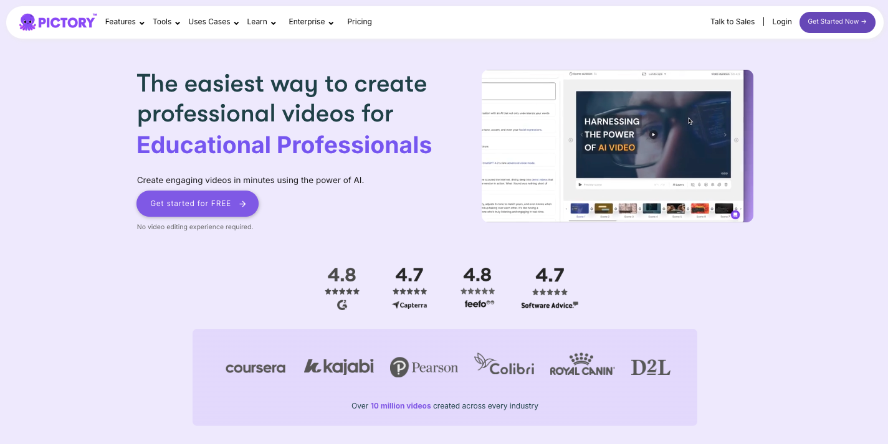

# Pictory Coupon Code (2025) – Get 20% OFF + Free Trial

Making great videos used to be a pain — hours of editing, hiring pricey freelancers, or trying to figure out complicated software. And let’s be honest, most of us don’t have the time (or patience) for that.

But in 2025, if you’re not using video content, you’re falling behind. Videos grab attention, boost engagement, and convert way better than most other formats. The only problem? Creating them still feels like a hassle for a lot of people.

That’s where Pictory comes in. It’s an AI-powered video tool that turns your scripts, blog posts, or even Zoom recordings into scroll-stopping videos in just a few minutes. And the best part? You can try it for free and even grab a discount using our Pictory coupon code.

## Pictory Coupon Code + Free Trial Details (2025)

Want to try Pictory and save money at the same time? Good news — there’s a way to get a free trial and unlock a sweet discount with a Pictory coupon code.

### Pictory Coupon Deal (2025) 🔥 
- **Coupon Code**: `LokenderKumar05`  
- **Discount**: Save up to **20% OFF** on paid plans  
- **Free Trial**: Get started with **no credit card required**  
- **Bonus**: Full access to core features during trial

Whether you're testing the waters or ready to commit, this deal lets you explore what Pictory can do — without breaking the bank.

### How To Claim Pictory Discount?
1. Click this link → **[Pictory Special Offer](https://pictory.ai?ref=lokenderkumar5)**
2. Choose a plan or start your free trial.
3. Apply the coupon code `**LokenderKumar05**` at checkout if it’s not auto-applied.

4. Enjoy easier, faster, better video creation.

## What is Pictory?

Pictory is an AI video creation tool that helps you make professional-looking videos without any editing experience. Whether you’re a content creator, digital marketer, coach, or small business owner, it’s built to save you time and make your videos look amazing.

You can turn blog posts into videos, repurpose long-form content into short clips, or even turn scripts into full-on video content — all with just a few clicks.

> No fancy gear, no editing skills, no stress.

## What You Can Do with Pictory

- Turn text into engaging videos  
- Repurpose webinars, Zoom calls, or podcasts into highlight clips  
- Create scroll-stopping content for TikTok, Reels, YouTube Shorts  
- Automatically add captions, trim silence, and clean up your footage  
- Choose from a massive library of templates, stock footage, and music  

If you’ve ever wanted to create videos faster (and without needing a video editor), Pictory’s your go-to.

## 🔑 Key Features of Pictory

| Feature             | Description                                                                 |
|---------------------|-----------------------------------------------------------------------------|
| 🎬 Text to Video     | Upload a blog post or script and watch it become a video in seconds.       |
| 🗣️ AI Voiceovers     | Choose from lifelike voices or upload your own.                            |
| ✂️ Video Highlights  | Auto-selects the best moments from long videos.                            |
| 💬 Automatic Captions| Boost engagement with accurate, auto-generated captions.                   |
| ✏️ Custom Branding   | Add your logo, choose fonts, colors, and styles.                           |
| 🌍 Cloud-Based Editing| No downloads. Edit anywhere, anytime.                                     |

## How Does Pictory Work?

Pictory makes turning long-form content into scroll-stopping videos super easy — even if you’ve never edited a video before.

### Here's how it works in 3 simple steps:

**1. Upload Your Content**  
Blog post, script, article, or Zoom recording — just drop it in.

**2. AI Does the Magic**  
Pictory auto-generates a video, selects visuals, adds captions, and syncs voiceovers.

**3. Customize & Publish**  
Tweak styles, add branding, and export your final video to share on any platform.

## 💰 Pictory Pricing – What Does It Cost?

Pictory offers flexible plans for solo creators, marketers, and teams.

🔽 Here's a quick pricing breakdown:

| Plan         | Monthly Price | Video Minutes | Stock Library                    | AI Voices                            | Brand Kits | Best For                       |
|--------------|---------------|----------------|----------------------------------|--------------------------------------|------------|-------------------------------|
| Starter      | $19/mo        | 200 mins       | 2M assets (Storyblocks)          | 7 languages (standard)               | 1          | Beginners, bloggers           |
| Professional | $39/mo        | 600 mins       | 12M assets (Getty + Storyblocks) | 120 mins (ElevenLabs, 29 languages)  | 5          | Marketers, content teams      |
| Teams        | $99/mo        | 1,800 mins     | Full access                      | 240 mins AI voices                   | 10         | Agencies, collaborations      |
| Enterprise   | Custom        | Custom         | Custom                           | Custom                               | Unlimited  | Large brands, automation needs|

## 📊 Pictory Pricing Comparison – Monthly vs Annual (With 20% OFF)

| Plan         | Monthly Price | Annual Price  *(Per Month)* | With 20% OFF  *(Per Month)* | Max Saving  *(Annual)*     |
|--------------|---------------|----------------------------------|----------------------------------|-------------------------------|
| **Starter**      | $25/month      | $19/month ($228/year)           | $15.20/month ($182.40/year)     | $45.60/year                  |
| **Professional** | $49/month      | $39/month ($468/year)           | $31.20/month ($374.40/year)     | $93.60/year                  |
| **Teams**        | $119/month     | $99/month ($1,188/year)         | $79.20/month ($950.40/year)     | $237.60/year                 |
| **Enterprise**   | Custom         | Custom                          | Custom                          | Varies                       |

👉 **Use code `LokenderKumar05` at checkout to activate your 20% OFF instantly!**

## ✅ Conclusion: Grab Your Pictory Discount Today!

If you’re looking to create high-quality videos without spending hours editing or hiring a pro, Pictory is the way to go.

It’s fast, beginner-friendly, and packed with powerful features to turn your content into engaging videos — even if you’ve never edited before.

With the **free trial + 20% discount**, you’ve got nothing to lose and a whole lot of content to gain.

👉 Click below to get started and see what Pictory can do for your brand, channel, or business:

🎁 **[Try Pictory With Discount →](https://pictory.ai?ref=lokenderkumar5)**

## Frequently Asked Questions (About Pictory Coupon Code)

**1. Does Pictory offer a free trial?**  
Yes! Pictory offers a free trial that lets you explore the platform and create videos with limited credits — no credit card required.

**2. How can I get a discount on Pictory?**  
Use our exclusive link and coupon code `LokenderKumar05` to get 20% off your Pictory subscription.

**3. Do I need video editing experience to use Pictory?**  
Not at all! Pictory is made for beginners and marketers — AI handles the hard stuff.

**4. What kind of videos can I create with Pictory?**  
- Social media videos  
- YouTube Shorts  
- Video summaries  
- Promo content  
- Online course videos  
- And more!

**5. Can I cancel anytime?**  
Yes, Pictory offers monthly and annual plans — you can cancel anytime without penalties.

**6. Is the coupon code valid for annual plans?**  
Absolutely! The 20% discount applies to both monthly and annual subscriptions.
